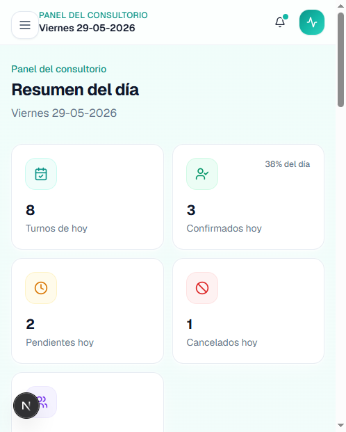
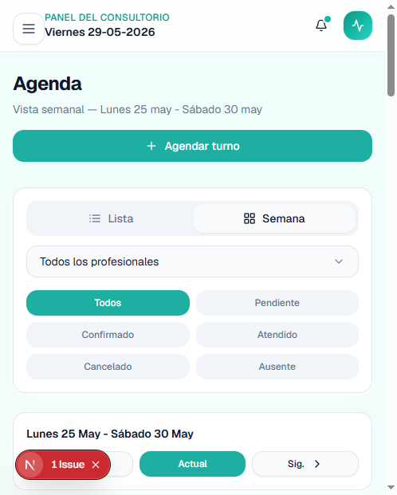
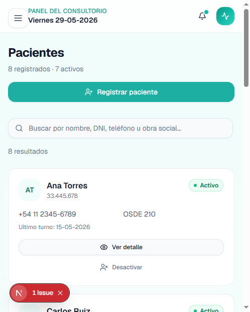
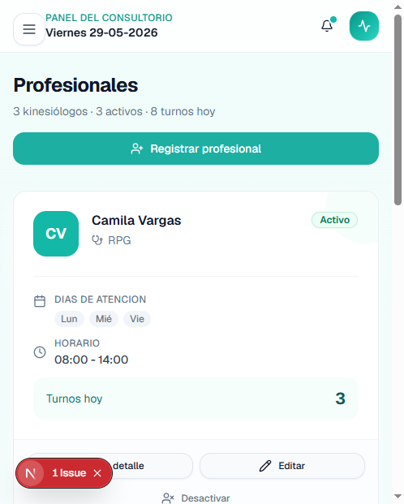

# KineTurnos

**Gestión kinesiológica moderna para consultorios**

Sistema web de demostración para organizar turnos, pacientes y profesionales en un consultorio de kinesiología. Diseñado como **case study de portfolio**: flujos completos, UI responsive y decisiones de arquitectura documentadas.

[](https://nextjs.org/)
[](https://react.dev/)
[](https://www.typescriptlang.org/)
[](https://tailwindcss.com/)


| | |
|---|---|
| **Demo en vivo** | **[kineturnos.vercel.app](https://kineturnos.vercel.app/)** |
| **Repositorio** | [github.com/Matiglorioso/kineturnos](https://github.com/Matiglorioso/kineturnos) |
| **Case study** | [kineturnos.vercel.app/proyecto](https://kineturnos.vercel.app/proyecto) |
| **Versión** | Demo v0.3 · PostgreSQL + Auth · 2026 |
| **Base de datos** | PostgreSQL (Neon) + Prisma — [setup local](docs/TU-PARTE-NEON.md) · [deploy Vercel](docs/TU-PARTE-VERCEL.md) |

---

## Descripción

**KineTurnos** es una aplicación full-stack para la operación diaria de un consultorio kinesiológico: panel de control, agenda por día o semana, fichas de pacientes y gestión del equipo profesional.

La demo prioriza **claridad de flujos**, **feedback inmediato** (toasts, estados vacíos, confirmaciones) y una **experiencia responsive** (mobile, tablet y desktop), con **persistencia en PostgreSQL (Neon)** vía API REST y Prisma.

---

## Problema que resuelve

En muchos consultorios, la coordinación de pacientes, profesionales y horarios depende de planillas, WhatsApp o agendas genéricas que no contemplan:

- Duración variable de sesiones
- Estados del turno (pendiente, confirmado, atendido, cancelado, ausente)
- Disponibilidad por profesional
- Historial por paciente

Eso genera **solapamientos**, **poca visibilidad del día** y **dificultad para seguir la carga de cada kinesiólogo**.

**KineTurnos** centraliza esa operación en una sola interfaz pensada para recepción y profesionales, reduciendo fricción en tareas repetitivas del día a día.

---

## Funcionalidades principales

### Panel de control
- Métricas del día: turnos totales, confirmados, pendientes, cancelados y pacientes activos
- Próximos turnos y actividad reciente
- Resumen por estado con distribución visual

### Agenda
- Vista **lista** (turnos del día) y **semanal** (lun–sáb)
- Filtros por estado y profesional
- Creación, edición y cambio de estado de turnos
- Validación de solapamientos y horarios del profesional
- Tabla en desktop y **cards apiladas** en mobile

### Pacientes
- Alta, edición, búsqueda y detalle con ficha completa
- Próximos turnos e historial de sesiones
- Activación / desactivación y eliminación con confirmación

### Profesionales
- CRUD de kinesiólogos con especialidad, días y horario de atención
- Duración estándar por sesión
- Turnos asignados y contador del día

### Experiencia de producto
- Modales accesibles (Radix UI)
- Toasts de éxito y error
- Empty states con acciones contextuales
- Diseño responsive y branding consistente (teal / salud)

---

## Capturas

> _Agregar imágenes del proyecto en `docs/screenshots/` y referenciarlas aquí._

| Dashboard | Agenda semanal |
|:---:|:---:|
| __ | __ |

| Pacientes | Profesionales |
|:---:|:---:|
| __ | __ |

---

## Demo

**[https://kineturnos.vercel.app/](https://kineturnos.vercel.app/)**

La app requiere **login**. Usuarios demo (contraseña `demo1234`):

| Rol | Email |
|-----|-------|
| Recepción | `recepcion@kineturnos.local` |
| Admin | `admin@kineturnos.local` |
| Profesional | `profe@kineturnos.local` |

El case study en [/proyecto](https://kineturnos.vercel.app/proyecto) es **público** (sin login).

---

## Tecnologías

| Tecnología | Uso en el proyecto |
|---|---|
| **Next.js 15** | App Router, layouts por módulo, metadata SEO |
| **React 19** | Componentes client para interactividad |
| **TypeScript** | Tipos de dominio: `Patient`, `Appointment`, `Professional` |
| **Tailwind CSS** | Sistema visual, responsive, animaciones |
| **shadcn/ui + Radix** | Diálogos, selects, alertas accesibles |
| **Lucide React** | Iconografía consistente |
| **date-fns** | Fechas en español y lógica de calendario |
| **Sonner** | Notificaciones toast |
| **Neon + Prisma 6** | PostgreSQL serverless + ORM |
| **API Routes (Next.js)** | CRUD REST: pacientes, profesionales, turnos |

---

## Instalación y ejecución

### Requisitos

- **Node.js** 18.18 o superior
- **npm** 9+

### Pasos

```bash
# Clonar el repositorio
git clone https://github.com/Matiglorioso/kineturnos.git
cd kineturnos

# Instalar dependencias
npm install

# Modo desarrollo
npm run dev
```

Abrí [http://localhost:3000](http://localhost:3000) en el navegador.

### Scripts disponibles

| Comando | Descripción |
|---|---|
| `npm run dev` | Servidor de desarrollo |
| `npm run dev:clean` | Libera el puerto 3000, limpia caché y arranca dev |
| `npm run build` | Build de producción |
| `npm run start` | Servidor de producción (post-build) |
| `npm run lint` | ESLint |
| `npm run clean` | Elimina caché de `.next` |
| `npm run db:push` | Sincroniza schema → Neon |
| `npm run db:seed` | Carga datos de demo |
| `npm run db:studio` | Prisma Studio (UI de la DB) |
| `npm run verify:migration` | Prueba automática DB + API (requiere `npm run dev` y `VERIFY_SECRET`) |

### Variables de entorno

```env
DATABASE_URL="postgresql://..."   # Neon (requerido)
AUTH_SECRET="..."                 # Auth.js (requerido para login)
VERIFY_SECRET="..."               # Bypass auth en verify:migration (local/CI)
NEXT_PUBLIC_SITE_URL=https://kineturnos.vercel.app
```

Copiá la plantilla desde `env.example` → `.env`.

**Local:** guía rápida en [`docs/TU-PARTE-NEON.md`](docs/TU-PARTE-NEON.md)  
**Producción (Vercel):** [`docs/TU-PARTE-VERCEL.md`](docs/TU-PARTE-VERCEL.md)  
**CI / verify:** [`docs/CI.md`](docs/CI.md)  
**Referencia completa:** [`docs/GUIA-NEON-PRISMA.md`](docs/GUIA-NEON-PRISMA.md)

```bash
npm run db:push    # Crear tablas en Neon
npm run db:seed    # Cargar datos de demo
npm run db:studio  # Ver la DB en el navegador
npm run verify:migration   # Verificar migración (con dev server activo)
```

---

## Deploy en Vercel

1. Agregar **`DATABASE_URL`** (connection string **Pooled** de Neon) en Environment Variables
2. Agregar **`AUTH_SECRET`** y **`NEXT_PUBLIC_SITE_URL`** = `https://kineturnos.vercel.app`
3. **Redeploy**
4. Probar login en `https://kineturnos.vercel.app/login` y `/api/health/db`

Detalle paso a paso: [`docs/TU-PARTE-VERCEL.md`](docs/TU-PARTE-VERCEL.md)

---

## Estructura del proyecto

```
kineturnos/
├── public/                 # Favicon e íconos estáticos
├── scripts/                # Utilidades CLI (limpieza de caché, puerto)
└── src/
    ├── app/                # Rutas App Router
    │   ├── page.tsx        # Dashboard (/)
    │   ├── agenda/         # Agenda lista y semanal
    │   ├── pacientes/      # Gestión de pacientes
    │   ├── profesionales/  # Gestión de kinesiólogos
    │   ├── proyecto/       # Case study del portfolio
    │   └── api/            # REST: patients, professionals, appointments, health/db
    ├── components/
    │   ├── agenda/         # Vistas de calendario
    │   ├── appointments/   # Turnos, badges, acciones
    │   ├── brand/          # Logo e identidad
    │   ├── dashboard/      # Widgets del panel
    │   ├── layout/         # Shell, sidebar, header
    │   ├── patients/       # Cards, tablas, diálogos
    │   ├── professionals/  # Cards y formularios
    │   ├── shared/         # Componentes reutilizables
    │   └── ui/             # Primitivos (shadcn-style)
    ├── data/               # Mocks para seed
    ├── hooks/              # usePatients, useProfessionals, useAppointments
    ├── lib/                # Validación, fechas, toasts, capa DB
    └── types/              # Tipos TypeScript del dominio
```

### Decisiones técnicas destacadas

- **Hooks de dominio** (`usePatients`, `useProfessionals`, `useAppointments`) consumen la API REST y mantienen estado en cliente con toasts de error
- **Validación en cliente y servidor** (DNI/matrícula únicos, solapamiento de turnos, horarios del profesional)
- **Formato de fecha `dd-MM-yyyy`** explícito en toda la app para evitar ambigüedad
- **Validación de turnos en capa de dominio** (`lib/appointment-validation.ts`) reutilizada en formularios y API
- **Patrón `closeDetailBeforeAction`** para evitar overlays congelados entre Dialog y AlertDialog

---

## Estado actual

| Área | Estado |
|---|---|
| UI / UX responsive | ✅ Completo |
| CRUD pacientes, profesionales y turnos | ✅ Completo |
| Agenda lista + semanal | ✅ Completo |
| Validación de horarios y solapamientos | ✅ Completo (cliente + servidor) |
| PostgreSQL (Neon) + Prisma | ✅ Completo |
| API REST + hooks conectados a DB | ✅ Completo |
| Validación DNI / matrícula únicos | ✅ Completo |
| Autenticación (login + middleware) | ✅ Completo |
| Sync `ultimo_turno` y nombres en turnos | ✅ Completo |
| CI GitHub Actions (lint, build, verify) | ✅ Completo |
| Deploy Vercel con `DATABASE_URL` + `AUTH_SECRET` | 📋 [Guía](docs/TU-PARTE-VERCEL.md) |
| Branding, metadata y favicon | ✅ Completo |
| Permisos finos por rol en UI/API | ❌ Pendiente |
| Notificaciones externas (email / WhatsApp) | ❌ No incluido |

### Limitaciones de la demo

- Roles definidos pero sin restricciones por pantalla (todos ven los mismos módulos)
- Un solo consultorio (sin multi-sede)
- Sin facturación, obras sociales avanzadas ni historial clínico detallado
- Sin recordatorios automáticos por email o WhatsApp

---

## Roadmap futuro

### Corto plazo
- Permisos por rol en UI y API (recepción / profesional / admin)
- Migraciones Prisma formales (`db:migrate`) en CI/CD
- Capturas en README y polish de portfolio

### Mediano plazo
- Recordatorios automáticos y confirmación por link
- Reportes exportables (PDF / Excel) y métricas históricas
- Bloqueo de agenda por feriados y sobreturnos

### Largo plazo
- Multi-consultorio y turnos online
- Integración con obras sociales y fichas clínicas
- App móvil o PWA para profesionales en sala

---

## Autor

**Matías Aliaga**

<!-- Agregar links personales cuando corresponda -->

| | |
|---|---|
| **GitHub** | [github.com/Matiglorioso/kineturnos](https://github.com/Matiglorioso/kineturnos) |
| **Demo** | [kineturnos.vercel.app](https://kineturnos.vercel.app/) |

---

## Licencia

Proyecto de demostración para portfolio. _[Definir licencia si se publica en GitHub — ej. MIT]_

---

<p align="center">
  Hecho con Next.js, TypeScript y PostgreSQL · Demo v0.3 · 2026
</p>
